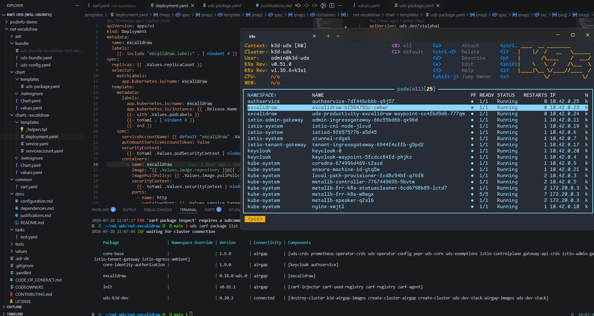
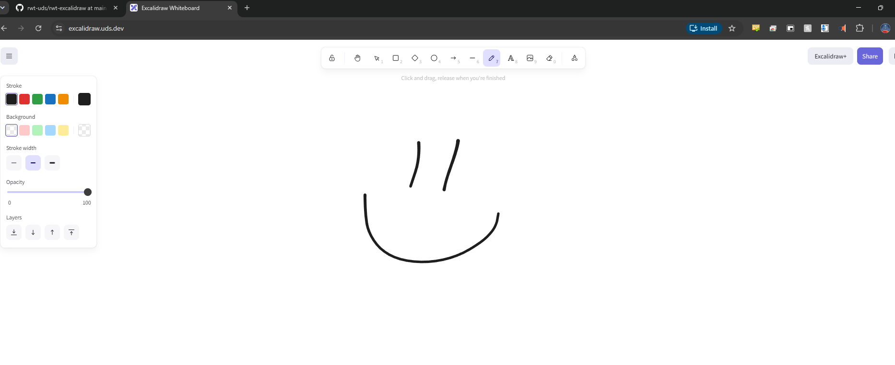

# Defense Unicorns UDS Test

## Demo

- demo went fine
  - custom user in task file easy to understand (edit bash script, zarf variables, sensitive values)
  - keycloak group, sso to Grafana and keycloak admin with mfa worked one shot
  - sso to podinfo wowee
  - great out of the box experience, clear config areas, excellent documentation

## Excalidraw Test

- want to add my own uds package
  - put podinfo-demo away in a folder
- zarf yaml schema vs maru yaml schema
- uds package requirements (DU engineer mandatory)
- used package template and replace/renamed things
- create local excalidraw chart (no upstream)
  - `mkdir -p charts && cd charts && helm create excalidraw`
- replace templates everywhere
- build basic excalidraw helm chart
  - pepr enforcing securitycontext
    - add temporary writable fs for nginx
    - working mvp helm chart for excalidraw
- now uds package config chart
  - flush out "application" style helm chart to wrap config
  - separates app chart from uds package config
- components and flavor distinction
  - only.flavor restricts
  - if component has no flavor it is always included
  - use flavor to label a meaningful distribution
  - example if there is a specific hardened version once securityContext is working fully
- `uds run dev`
  - the bundle creates the `.tar.zst` with chart version information, but the tool looks for it without that name
  - had to change bundle name to `chart-version-uds-bundle-version-flavorname`
- the zarf management of the package wraps plenty of health checking, config validation, logging, and QoL much desired.
- the istio image wasnt present so i reran the uds run default to restore cluster state
- verbose logging, clear errors
- package produced a bad state where image tag wasnt available in the local registry





### Commands

```bash
# no cluster
uds run default

# existing cluster
uds run dev

# extra useful commands

uds zarf package list

uds zarf package remove [name]

# keycloak make a user
uds zarf connect keycloak

# retrieve admin password from k8s secret
# change to uds realm
# add doug to UDS Core/Admin
# login to excalidraw.uds.dev

```